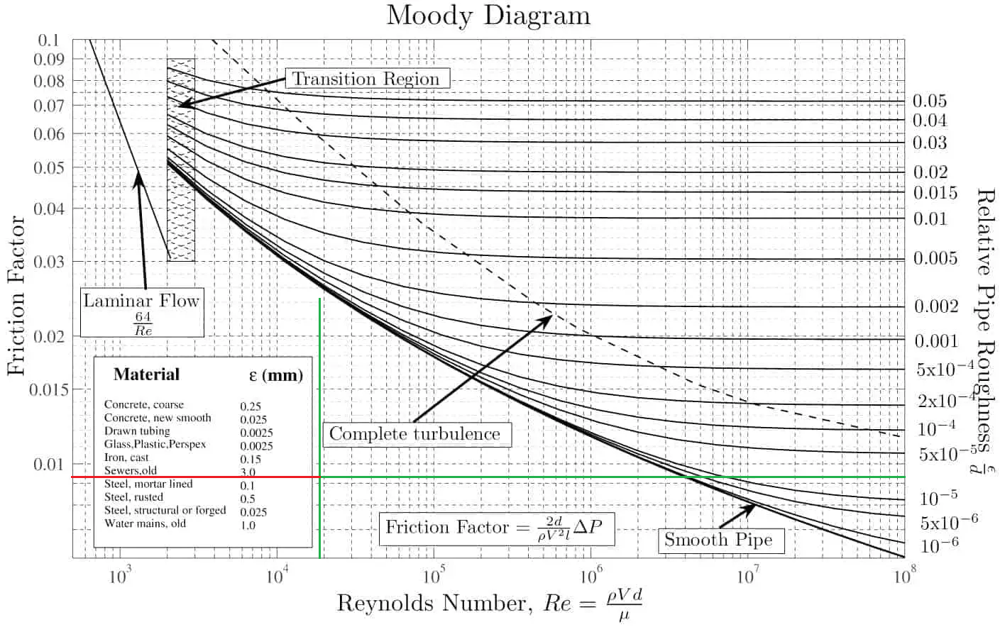
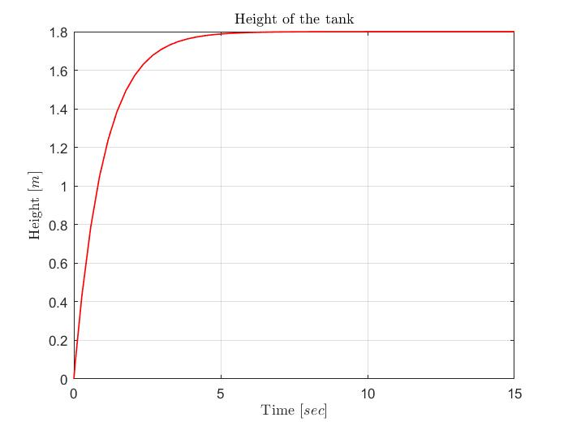
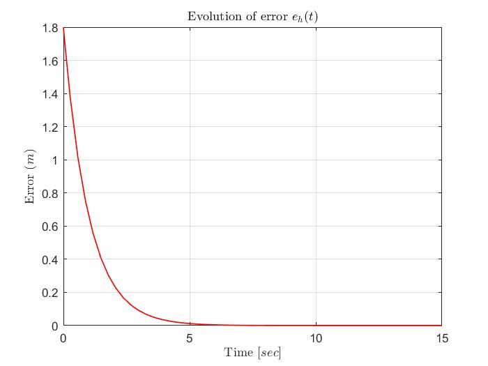
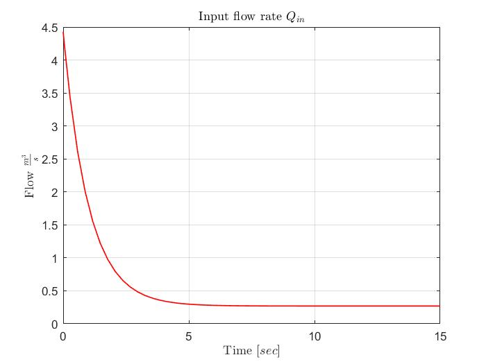

# Filling tank - model made in MATLAB

The MATLAB implementation used in this study is based on a model of fluid flow through a pipe and two valves. One valve controls the input flow, while the other valve regulates the height of the liquid in the tank by opening or closing. When both valves are in operation, liquid accumulates in the tank, and this can be expressed mathematically as follows:

$Q_{in} - Q_{out} = accumulation$

However, the accumulation of liquid can also be expressed as the volume of liquid that changes over time due to the operation of the two valves. The change in time occurs because the valves are not always open or closed.

$accumulation = \frac{\Delta V}{dt}$

If we consider a tank with a constant cross-sectional area, we can write the volume as the product of the area and the height of the tank. However, in this case, the height changes, and the result is:

$\Delta V = A * dh$

The output flow can be expressed as the driving force that pushes the liquid out of the tank. This force can be calculated using the following equation:

$Q_{out} = \frac{\rho g h}{R}$

where R is the resistance of the valve used to discharge the tank. The value of the resistance can be determined using the Darcy-Weisbach equation:

$\Delta P = Lf\frac{\rho}{2}\frac{v^{2}}{2}$

where $L$ is the longitude from the pipe for the output valve. $\rho$ is the density of the liquid, $v$ is the velocity of the flow, $D$ is the diameter of the pipe (connected with the valve), and $f$ is the friction factor. The friction factor can be calculated using the Colebrook-White equation or using a Moody diagram. Using the Moody diagram you only need to calculate the Reynolds number and the relative roughness that dependes of the material of the pipe.

$Reynolds number = \frac{\rho v D}{\mu}$

$roughness = \frac{\epsilon}{D}$

After performing these calculations, the values can be checked on the graph below.

To determine the friction factor, draw a green vertical line corresponding to the Reynolds number obtained and a green horizontal line for the value of relative roughness in the pipe. The intersection of these lines represents the friction factor. Additionally, remember that the Reynolds number indicates whether the flow is laminar, transitioning between laminar and turbulent, or fully turbulent.

After applying the Darcy-Weisbach equation, the resistance can be calculated using the equation shown below, where K is a correction factor dependent on the pipe's geometry:

$R = \frac{\Delta P}{\rho v^{2}A} * K [\frac{Ns}{m^{5}}]$

To calculate K we have to check the corresponding value in the datasheet of the valve used. This value it depends of the flow coefficient $C_{v}$. For example for a full bore ball valve when is totally open we can use the next equation to calculate $K$:

$K = \frac{C_{v}}{1.156}$

This data depends on manufacturer's datasheet; Here you can see an [example](https://www.emerson.com/documents/automation/product-data-sheet-l-g-series-cv-data-en-us-175946.pdf).  

__While I am not an expert in this field, I have done my best to simulate the control system using this information.__

The differential equation for the control system can be written as:

$\frac{AR}{\rho g}\frac{dh}{dt} + h = Q_{in}\frac{R}{\rho g}$

### Control system

First i rewritte the equation leaving the term with high order from the differential equation in one side.

$\frac{dh}{dt} = \frac{Q_{in}}{A} - h(\frac{\rho g}{A R})$

To achieve the objective of having the liquid reach a specific height, the error must be zero when the liquid reaches that height. To accomplish this, it is necessary to find a Lyapunov function that allows the system to gain energy while indicating a loss of energy through its derivative, which must be negative.

- Objectives:

1. $V = \frac{1}{2}e_{h}^{2} > 0$
2. $\dot{V} = -ke_{h}^{2} < 0$

To achieve this, the error can be defined as the difference between the desired and actual liquid heights, and its derivative can be found as:

$e_{h}(t) = h_{d} - h(t)$

Whose derivative is equal to:

$\dot{e_{h}}(t) = \frac{dh_{d}}{dt} - \frac{dh}{dt}$

However, the derivative of the desired height is zero since its value is constant.

$\dot{e_{h}}(t) = - \frac{dh}{dt}$

In this case, the loss of energy from the system can be considered ideal, as it can be expressed as follows:

$\dot{V} = e_{h}\dot{e_{h}}$

In this case i set the equation of ideal loss with the real loss to obtain:

$-ke_{h}^{2} = e_{h}\dot{e_{h}}$

$\dot{e_{h}} = -ke_{h}$

$-\frac{dh}{dt} = -k(h_d - h)$

By setting the ideal loss equation equal to the actual loss equation, we obtain:

$\frac{Q_{in}}{A} - h(\frac{\rho g}{A R}) = ke_{h}$

Where the input to the system is the input flow $Q_{in}$, so in the equation we separate this value to one side of the equation:

$Q_{in} = Ake_{h} + h(\frac{\rho g}{R})$

Here, the input flow rate is separated on one side of the equation. This is the control function that I have used to develop a simulation using Matlab and Simulink. Please note that the resistance value used is for testing purposes only, but I hope it is helpful to someone that read this.

